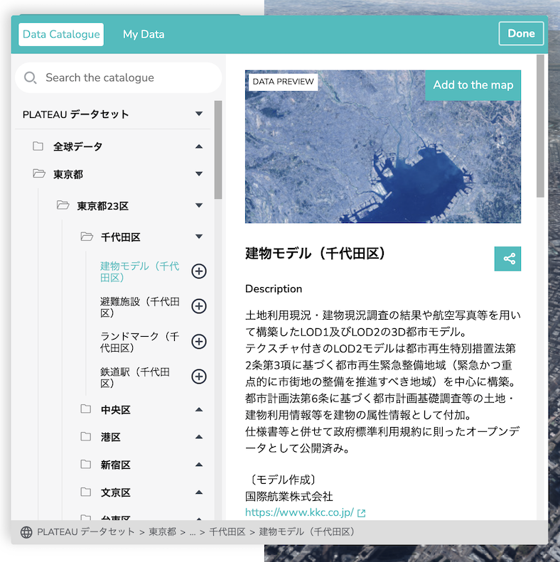
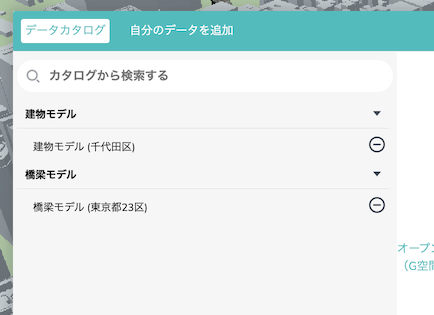

# plateau-catalog-generator

TerriaJS 製 PLATEAU VIEW のためのカタログファイルジェネレーター。

## カタログとは

カタログとは、PLATEAU VIEW 上に表示するデータセットを制御するための設定ファイルです。
カタログによって、データ一覧のフォルダ分け、各データセットのタイトルや説明文、データセットを読み込んだ際の見た目等を制御することができます。



## このプログラムについて

このプログラムは、表 (CSV) 形式で定義したカタログの情報から、PLATEAU VIEW で使用可能なカタログファイルを生成するコマンドラインツールです。
カタログの情報を表形式で管理することで、エクセル等の表計算ソフトを使用して直観的にカタログを編集することができるようになります。

なお、このプログラムの役割はカタログを生成することであり、データ自体の生成、変換は行いません。

## 動作要件

本プログラムの動作には以下が必要です。

- node.js (バージョン 12、14、16、17 のいずれか)

## インストール方法

コマンドラインで以下のコマンドを実行します。

```powershell
npm i -g https://github.com/Project-PLATEAU/plateau-catalog-generator/releases/download/v1.0.0/plateau-catalog-generator-1.0.0.tgz
```

インストールが終わったら、正常にインストールできたことを確認するために次のコマンドを実行してください。

```powershell
plateau-catalog-generator
```

インストールが成功していれば、以下のようなヘルプメッセージが表示されます。

```
error: missing required argument 'source'

Usage: plateau-catalog-generator [options] <source> <destination>

CSV 形式で定義したカタログの情報から、PLATEAU VIEW で使用可能なカタログファイルを生成するコマンドラインツールです。

Arguments:
  source       catalog.csv が置いてあるディレクトリへのパス。
  destination  生成するカタログファイルへのパス。

Options:
  -h, --help   ヘルプ (今表示されているもの) を表示します。
```

## 使い方

このレポジトリの [`docs/samples/1_basic`](/docs/samples/1_basic) に、簡単なカタログを定義した CSV ファイル (`catalog.csv`) があります。

```
📂 1_basic
└─📘 catalog.csv
```

※サンプルをダウンロードするために、レポジトリ全体を zip 形式でダウンロードして展開することをおすすめします。

コマンドラインで次のコマンドを実行すると、カタログファイル (`terria.json`) が生成されます。

```powershell
cd <リポジトリのルート>\docs\samples\1_basic
plateau-catalog-generator . terria.json
```

生成された `terria.json` を PLATEAU VIEW のアプリケーションサーバーの `wwwroot\init\` にコピー (既存の `terria.json` を上書き) すると、PLATEAU VIEW のカタログに反映されます。



### catalog.csv の書き方

catalog.csv では**データの表示名** (`name[1]`、`name[2]`、...)、**タイプ** (`type`)、**URL** (`url`) を指定します。上掲のサンプルでは次のような内容になっています。

`catalog.csv`

| name[1]    | name[2]                   | type     | url                                                                                                       |
| ---------- | ------------------------- | -------- | --------------------------------------------------------------------------------------------------------- |
| 建物モデル |                           | group    |                                                                                                           |
|            | 建物モデル (千代田区)     | 3d-tiles | https://plateau.geospatial.jp/main/data/3d-tiles/bldg/13100_tokyo/13101_chiyoda-ku/notexture/tileset.json |
| 橋梁モデル |                           | group    |                                                                                                           |
|            | 橋梁モデル (東京都 23 区) | 3d-tiles | https://plateau.geospatial.jp/main/data/3d-tiles/brid/13100_tokyo/tileset.json                            |

#### `name[1]`、`name[2]`、...

データの表示名および入れ子関係を表します。表示名を記入する列によって、データの入れ子関係を表すことができます。例えば、上の例で「建物データ (千代田区)」は「建物データ」よりも深い位置にあります。これにより、VIEW 上では「建物データ (千代田区)」が「建物データ」フォルダの中に表示されます。

#### `type`

`type` はデータ形式を表します。PLATEAU VIEW で利用しているデータセットには主に次の形式があります。

```
group (フォルダ)
3d-tiles (建物モデル、橋梁モデルなど)
mvt (道路、用途地域など)
geojson (鉄道、緊急輸送道路など)
czml (避難施設、行政界など)
```

`group` は特殊な形式であり、VIEW 上ではデータセットではなくフォルダとして表示されます。

なお、PLATEAU VIEW は TerriaJS というライブラリを使用して作られています。TerriaJS では、上に挙げたもの以外にもさまざまなデータ形式をサポートしています。サポートされているデータ形式の一覧は、TerriaJS のドキュメント https://docs-v8.terria.io/guide/connecting-to-data/catalog-items/ で確認することができます。

#### `url`

`url` はデータセットの URL を表します。PLATEAU VIEW では G 空間情報センターが配信するデータセットを利用しており、上掲のサンプルでも G 空間情報センターの URL を指定しています。独自のデータセットを利用する場合、PLATEAU VIEW のアプリケーションサーバーの `wwwroot\` 以下にファイルを置くことでデータセットを配信することができます。また、外部のサービス (S3 など) を利用してデータセットの配信を行うこともできます。

### さまざまな形式のデータセットを表示する

このレポジトリの [`docs/samples/2_more_types`](/docs/samples/2_more_types) には、3d-tiles、mvt、geojson、czml のサンプルデータを表示するカタログがあります。PLATEAU VIEW を使ってデータセットを表示する際のサンプルとしてご活用ください。

## より詳しい使い方

このプログラムでは、以下に挙げるような設定を行うこともできます。

- データセットの説明文を表示する
- 凡例を表示する
- 属性表の表示をカスタマイズする

詳しい使い方は別添の[使い方ガイド](./docs/GUIDES.md)を参照してください。
