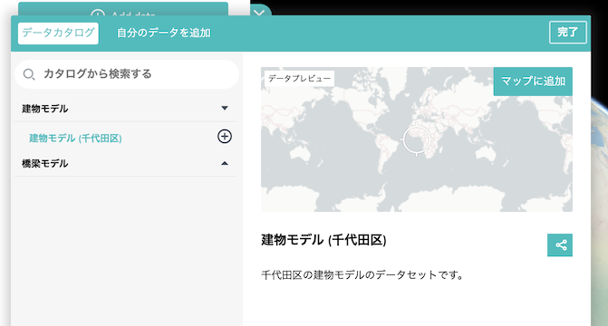
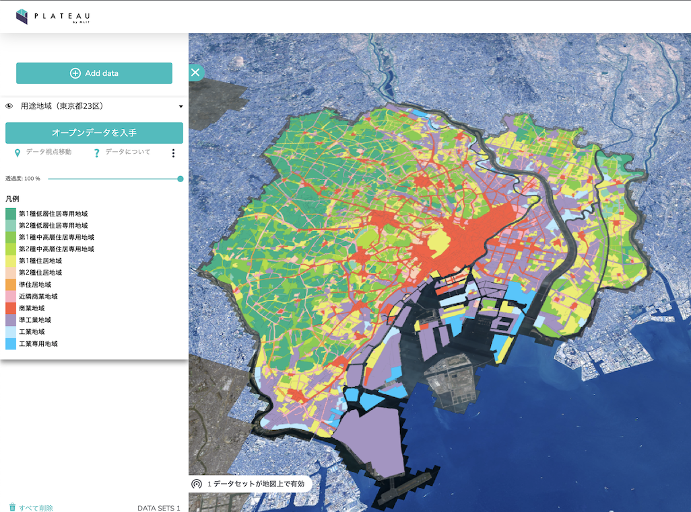
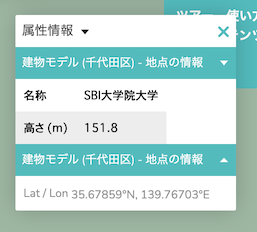
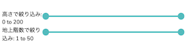

# plateau-catalog-generator 使い方ガイド

## 説明文を表示する

データセットに説明文を追加するには、`catalog.csv`と同じフォルダに`descriptions`という名前のフォルダを作り、その中に説明文をプレーンテキスト (`*.txt`) で配置します。サンプルフォルダ [`docs/samples/3_descriptions`](/docs/samples/3_descriptions) の構成を以下に示します。

```
📂 3_descriptions
├─📘 catalog.csv
│
└─📂 descriptions
    ├─📘 template_1.txt
    └─📘 template_2.txt
```

`catalog.csv` には `description` という名前の列を追加し、使用する説明文のファイル名 (拡張子 `.txt` を除く) を記入します。

`catalog.csv`

| name[1]    | name[2]                   | type     | url                                                                                                       | description | description[1]           |
| ---------- | ------------------------- | -------- | --------------------------------------------------------------------------------------------------------- | ----------- | ------------------------ |
| 建物モデル |                           | group    |                                                                                                           | template_1  | 建物モデル               |
|            | 建物モデル (千代田区)     | 3d-tiles | https://plateau.geospatial.jp/main/data/3d-tiles/bldg/13100_tokyo/13101_chiyoda-ku/notexture/tileset.json | template_2  | 千代田区の建物モデル     |
| 橋梁モデル |                           | group    |                                                                                                           | template_1  | 橋梁モデル               |
|            | 橋梁モデル (東京都 23 区) | 3d-tiles | https://plateau.geospatial.jp/main/data/3d-tiles/brid/13100_tokyo/tileset.json                            | template_2  | 東京都 23 区の橋梁モデル |

説明文の中には `{{1}}`、`{{2}}`、... という形式のプレースホルダーを置くことができます。例えば、上掲のサンプルの「建物モデル（千代田区）」の説明文 `template_2.txt` の内容は、次のようになっています。

```template_2.txt
{{1}}のデータセットです。
```

`{{1}}`、`{{2}}`、... に入る文字列は、`catalog.csv` の中の `description[1]`、`description[2]`、...などの対応する列に記入します。上記の「建物モデル」の場合、説明文の中の `{{1}}` の部分が、`catalog.csv` の `description[1]` に記入した「千代田区の建物モデル」で置き換わり、最終的な説明文は以下のようになります。

```
千代田区の建物モデルのデータセットです。
```



## Mapbox Vector Tiles のスタイルや凡例を定義する

Mapbox Vector Tiles (mvt) のデータは、凡例を定義することで塗りや線の色をコントロールできます。凡例を定義するには、`catalog.csv` と同じフォルダに `legends` という名前のフォルダを作り、その中に凡例の色や表示名を定義した CSV ファイルを配置します。サンプルフォルダ [`docs/samples/4_legends`](/docs/samples/4_legends) の構成を以下に示します。

```
📂 4_legends
├─📘 catalog.csv
│
└─📂 legends
    └─📘 yotochiiki.csv
```

`catalog.csv` には `legend` という名前の列を追加し、使用する凡例のファイル名 (拡張子 `.csv` を除く) を記入します。

`catalog.csv`

| name[1]             | name[2]                  | type  | url                                                                                | legend     |
| ------------------- | ------------------------ | ----- | ---------------------------------------------------------------------------------- | ---------- |
| Mapbox Vector Tiles |                          | group |                                                                                    |            |
|                     | 道路（東京都 23 区）     | mvt   | https://plateau.geospatial.jp/main/data/mvt/tran/13100_tokyo/{z}/{x}/{y}.mvt       |            |
|                     | 用途地域（東京都 23 区） | mvt   | https://plateau.geospatial.jp/main/data/mvt/yotochiiki/13100_tokyo/{z}/{x}/{y}.mvt | yotochiiki |

`legends\` に配置した CSV ファイルでは、MVT のレイヤ名とそれに対応する表示名や色を指定します。色は 16 進法 (`#000000` 〜 `#FFFFFF`) のほか、RGB (`rgb(0, 0, 0)` 〜 `rgb(255, 255, 255)`) でも指定できます。

`yotochiiki.csv`

| mvtLayer | title                     | color   |
| -------- | ------------------------- | ------- |
| yoto_1   | 第 1 種低層住居専用地域   | #00b285 |
| yoto_2   | 第 2 種低層住居専用地域   | #7bd2b7 |
| yoto_3   | 第 1 種中高層住居専用地域 | #78ce3f |
| yoto_4   | 第 2 種中高層住居専用地域 | #addf21 |
| yoto_5   | 第 1 種住居地域           | #ebee5e |
| yoto_6   | 第 2 種住居地域           | #ffd2b6 |
| yoto_7   | 準住居地域                | #ffa638 |
| yoto_9   | 近隣商業地域              | #ffb0c3 |
| yoto_10  | 商業地域                  | #ff593d |
| yoto_11  | 準工業地域                | #a794c5 |
| yoto_12  | 工業地域                  | #b9eaff |
| yoto_13  | 工業専用地域              | #0ec7ff |

これにより、以下の画像のように凡例および塗り色の指定が反映されます。



なお、`legends\` に配置する CSV ファイルで指定できるオプションは以下の通りです。

| 列名         | 意味               |
| ------------ | ------------------ |
| title        | 凡例における表示名 |
| color        | 塗りの色           |
| outlineColor | 線の色             |
| mvtLayer     | MVT のレイヤ名     |
| mvtLineWidth | MVT の線の太さ     |

なお、MVT 以外のデータセットに対しても同様の方法で凡例を定義することができますが、地図上の地物の色を定義する機能は MVT のデータセットに対してのみ有効です。

## 属性表テンプレートを使う

地図上で地物をクリックすると属性表が表示されます。属性表の見出しにはデータに定義された属性名が使われますが、それとは異なる表示用の属性名を設定することもできます。属性名を指定するには、`catalog.csv` と同じフォルダに `feature_info_templates` という名前のフォルダを作り、その中にデータ上の属性名と表示用の属性名の対照表を CSV (`*.csv`) 形式で配置します。サンプルフォルダ [`docs/samples/5_feature_info_templates`](/docs/samples/5_feature_info_templates) の構成を以下に示します。

```
📂 5_feature_info_templates
├─📘 catalog.csv
│
└─📂 feature_info_templates
    └─📘 bldg.csv
```

`catalog.csv` には `feature_info_template` という名前の列を追加し、使用する対照表のファイル名 (拡張子 `.csv` を除く) を記入します。

`catalog.csv`

| name[1]    | name[2]               | type     | url                                                                                                       | feature_info_template |
| ---------- | --------------------- | -------- | --------------------------------------------------------------------------------------------------------- | --------------------- |
| 建物モデル |                       | group    |                                                                                                           |                       |
|            | 建物モデル (千代田区) | 3d-tiles | https://plateau.geospatial.jp/main/data/3d-tiles/bldg/13100_tokyo/13101_chiyoda-ku/notexture/tileset.json | bldg                  |

`feature_info_templates\` には、以下のようなフォーマットで属性名の対応関係を記述した CSV ファイルを配置します。

`bldg.csv`

| name     | property |
| -------- | -------- |
| 名称     | 名称     |
| 高さ (m) | 計測高さ |

対照表の `name` 列には表示用の属性名を、`property` 列にはデータ上の属性名を指定します。



なお、`catalog.csv` に `feature_info_template[exclude]` という名前の列を追加することで、対照表に記述した属性の一部を非表示にすることができます。例えば、上の例で高さを非表示にするには、`catalog.csv` に `feature_info_template[exclude]` 列を追加し、`計測高さ` と記入します。

逆に、特定の属性をデフォルトで非表示にすることもできます。対照表に `default` という名前の列を追加し、非表示にしたい行に `exclude` と記入します。高さをデフォルトで非表示にする場合、対照表は次のようになります。

`bldg.csv`

| defult  | name     | property |
| ------- | -------- | -------- |
|         | 名称     | 名称     |
| exclude | 高さ (m) | 計測高さ |

デフォルトで非表示となっている属性を表示するには、`catalog.csv` に `feature_info_template[include]` という名前の列を追加し、そこに表示したい属性の名称を記述します。例えば、上記の例で計測高さを表示するには、`catalog.csv` の `feature_info_template[include]` に `計測高さ` と記入します。

## 高度な設定

本プログラムは、TerriaJS の設定項目のうち、特に説明文、凡例、属性表の管理を効率化することに焦点を当てていますが、それ以外の項目を設定する方法も提供しています。これにより、例えばスライダー式の UI でモデルを絞り込めるようにする等、高度な設定を行うことができます。

これらの設定を適用するには、`catalog.csv` と同じフォルダに `options` という名前のフォルダを作り、その中に設定内容を記述した JSON (`*.json`) 形式のファイルを配置します。サンプルフォルダ [`docs/samples/6_options`](/docs/samples/6_options) の構成を以下に示します。

```
📂 6_options
├─📘 catalog.csv
│
└─📂 options
    ├─📘 filters_height.json
    └─📘 filters_floor.json
```

`catalog.csv` には `options` という名前の列を追加し、適用したい設定内容を記述したファイルのファイル名 (拡張子 `.json` を除く) を記入します。なお、複数のファイルに記述した設定内容をまとめて適用したい場合、ファイル名を `,` で区切って記入します。

`catalog.csv`

| name[1]    | name[2]               | type     | url                                                                                                       | options                      |
| ---------- | --------------------- | -------- | --------------------------------------------------------------------------------------------------------- | ---------------------------- |
| 建物モデル |                       | group    |                                                                                                           |                              |
|            | 建物モデル (千代田区) | 3d-tiles | https://plateau.geospatial.jp/main/data/3d-tiles/bldg/13100_tokyo/13101_chiyoda-ku/notexture/tileset.json | filters_height,filters_floor |

`options\` には、設定内容を JSON 形式で記述して配置します。

`filters_height.json` (高さによるフィルタリングの設定)

```json
{
  "filters": [
    {
      "name": "高さで絞り込み",
      "property": "計測高さ",
      "minimumValue": 0,
      "maximumValue": 200,
      "minimumShown": 0,
      "maximumShown": 200
    }
  ]
}
```

`filters_floor.json` (地上階数によるフィルタリングの設定)

```json
{
  "filters": [
    {
      "name": "地上階数で絞り込み",
      "property": "地上階数",
      "minimumValue": 1,
      "maximumValue": 50,
      "minimumShown": 1,
      "maximumShown": 50
    }
  ]
}
```

`catalog.csv` では `filters_height,filters_floor` と 2 つのファイルのファイル名を記述しているため、カタログには両方の設定が適用されます。



設定の記述方法について、詳しくは [TerriaJS のドキュメント](https://docs-v8.terria.io/guide/connecting-to-data/catalog-items/)を参照してください。

## 初期ビューを設定する

PLATEAU VIEW を読み込んだ際のカメラ位置を指定するには、`catalog.csv` と同じフォルダに `init.json` という名前のファイルを作り、JSON 形式でカメラの座標位置を指定します。指定の仕方を示したサンプルフォルダ [`docs/samples/7_init`](/docs/samples/7_init) の構成を以下に示します。

```
📂 7_init
├─📘 catalog.csv
└─📘 init.json
```

以下は、サンプルフォルダで使用している `init.json` の例です。この例では、カメラの撮影範囲を東京都千代田区付近に設定しています。

`init.json`

```json
{
  "initialCamera": {
    "west": 139.7383852716238,
    "south": 35.669499299672474,
    "east": 139.78656930734346,
    "north": 35.691640758557284,
    "position": {
      "x": -3962169.8364513335,
      "y": 3352586.704708458,
      "z": 3698023.4610325196
    },
    "direction": {
      "x": 0.7259273188627007,
      "y": -0.5727789601171913,
      "z": 0.380727974511829
    },
    "up": {
      "x": -0.27833913197344085,
      "y": 0.2615484931093981,
      "z": 0.9241859733649255
    }
  }
}
```

カメラ位置のパラメーターを取得するには、PLATEAU VIEW で実際にその位置を表示し、右上の「Share / Print」ボタンから共有 URL を取得します。共有 URL は[パーセントエンコーディング](https://ja.wikipedia.org/wiki/パーセントエンコーディング)によってエンコードされているため、まずはデコードします。

※パーセントエンコーディングは「[encode Max](https://encodemax.com/)」(Project PLATEAU 外のページを開きます) などのサービスを使うとデコードできます。

デコードすると、次のような文字列が得られます。

```
http://plateauview.mlit.go.jp/#start={"version":"8.0.0","initSources":[{"stratum":"user","models":{},"workbench":[],"timeline":[],"initialCamera":{"west":139.73885126866716,"south":35.66689010272888,"east":139.78615180821535,"north":35.693190401357775,"position":{"x":-3962169.8364513335,"y":3352586.704708458,"z":3698023.4610325196},"direction":{"x":0.7259273188627009,"y":-0.5727789601171911,"z":0.3807279745118288},"up":{"x":-0.27833913197344085,"y":0.2615484931093983,"z":0.9241859733649254}},"homeCamera":{"west":139.63595,"south":35.53022,"east":139.95451,"north":35.81489},"baseMaps":{"defaultBaseMapId":"/basemap//全国最新写真+(シームレス)"},"viewerMode":"3d","currentTime":{"dayNumber":2459660,"secondsOfDay":77597.944},"showSplitter":false,"splitPosition":0.4999,"stories":[]}]}
```

この中の

```
"initialCamera":{"west":139.73885126866716,"south":35.66689010272888,"east":139.78615180821535,"north":35.693190401357775,"position":{"x":-3962169.8364513335,"y":3352586.704708458,"z":3698023.4610325196},"direction":{"x":0.7259273188627009,"y":-0.5727789601171911,"z":0.3807279745118288},"up":{"x":-0.27833913197344085,"y":0.2615484931093983,"z":0.9241859733649254}}
```

の部分から数字を抜き出し`init.json`に書き込みます。

`init.json` では、TerriaJS がサポートしているその他のオプションも指定できます。サポートされているオプションの一覧は[TerriaJS のドキュメントの Initialization Files のページ](https://docs.terria.io/guide/customizing/initialization-files/)を参照してください。
